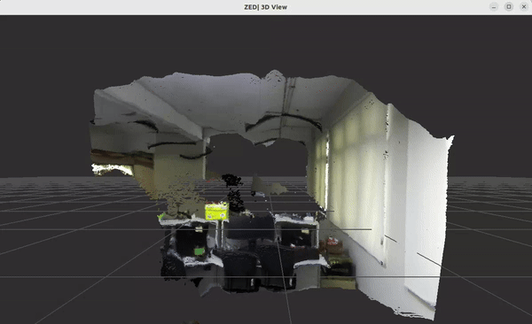
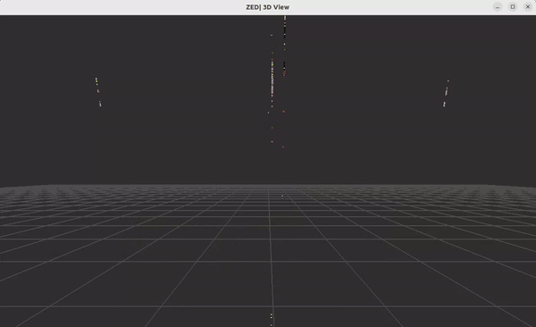
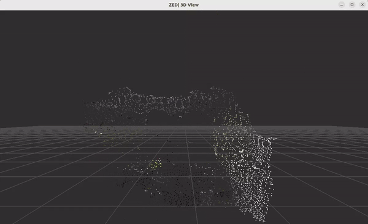
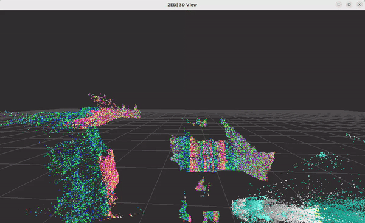

# zed-open3d
Stereolab Zed camera stream to work with open3d

### Tested on following Hardware
1. Nvidia Geforce RTX3060 (Driver Version: 545.23.08)
2. Zed-m Camera

### Systems & Dependencies
1. Ubuntu 22.04 LTS
2. [ZED SDK v4.08](https://www.stereolabs.com/developers/release#82af3640d775)
3. [Open3D v0.18](https://www.open3d.org/docs/release/compilation.html#compilation)

## Example
Using openGL renderer by zed sdk samples, camera streaming at 720p@60fps

### CPU

does not work well with stream ... 

| Conversion      | Voxel Downsample     | Uniform Downsample      |
|---------------|---------------|---------------|
|  |  |  |

### GPU

data corrupted ...

